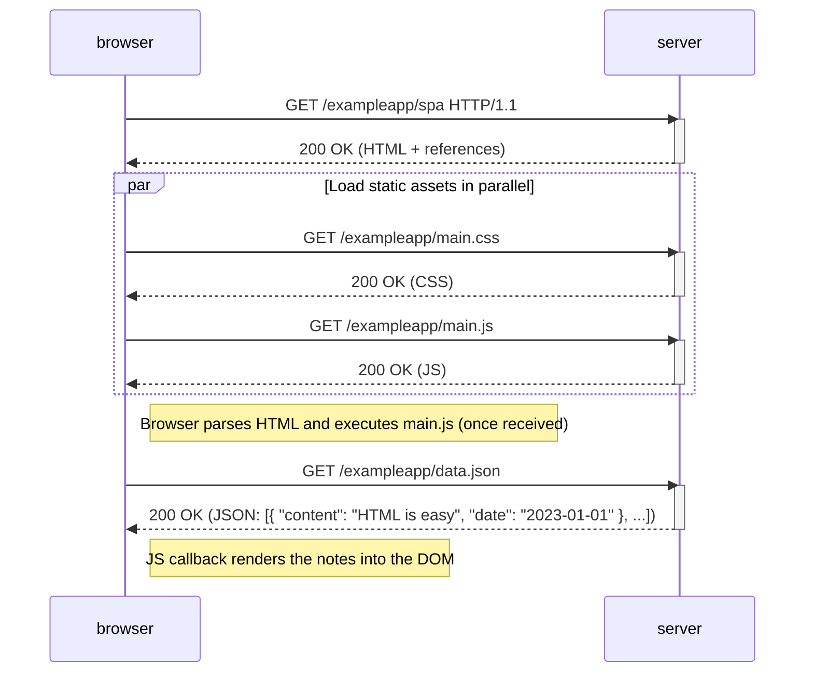

```mermaid
sequenceDiagram
    participant browser
    participant server

    browser->>server: GET /exampleapp/spa HTTP/1.1
    activate server
    server-->>browser: 200 OK (HTML + references)
    deactivate server

    par Load static assets in parallel
        browser->>server: GET /exampleapp/main.css
        activate server
        server-->>browser: 200 OK (CSS)
        deactivate server

        browser->>server: GET /exampleapp/main.js
        activate server
        server-->>browser: 200 OK (JS)
        deactivate server
    end

    Note right of browser: Browser parses HTML and executes main.js (once received)

    browser->>server: GET /exampleapp/data.json
    activate server
    server-->>browser: 200 OK (JSON: [{ "content": "HTML is easy", "date": "2023-01-01" }, ...])
    deactivate server

    Note right of browser: JS callback renders the notes into the DOM
```